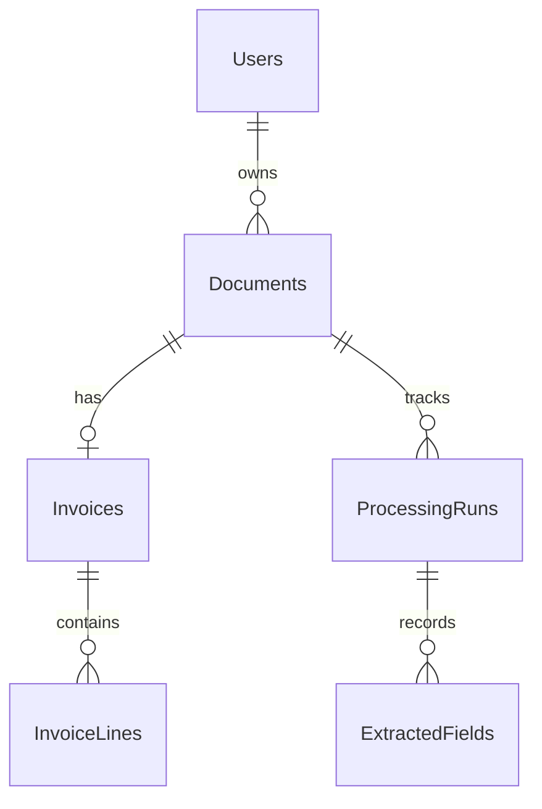

# Architecture

[Project overview](../README.md) · [Setup](../Wida.Api/README.md) · [API reference](api.md)

## Projects and dependencies

The solution contains three application projects and an automated test project, all targeting .NET 10:

| Project | Responsibility | Main entry points |
| --- | --- | --- |
| `Wida.Api` | HTTP routing, upload validation, storage selection, JSON serialization, configuration, and OpenAPI/Scalar. | [Program.cs](../Wida.Api/Program.cs), [controllers](../Wida.Api/Controllers) |
| `Wida.Bll` | Document, invoice, and processing workflows; DTO mapping; invoice validation. | [services](../Wida.Bll/Services), [DTOs](../Wida.Bll/Dtos), [InvoiceValidator](../Wida.Bll/Validators/InvoiceValidator.cs) |
| `Wida.Dal` | EF Core entities, PostgreSQL mappings and migrations, repositories, analysis contracts/models, local/Supabase storage adapters, Data Protection key persistence, and the Azure analyzers. | [WidaDbContext](../Wida.Dal/Persistence/WidaDbContext.cs), [repositories](../Wida.Dal/Repositories), [AzureDocumentAnalyzer](../Wida.Dal/Services/AzureDocumentAnalyzer.cs) |
| `Wida.Tests` | Automated workflow and extraction regression tests using Azure response fixtures, SQLite transaction tests, and EF InMemory fixtures. | [tests](../Wida.Tests) |

Declared project references are `Wida.Api → Wida.Bll`, `Wida.Api → Wida.Dal`, and `Wida.Bll → Wida.Dal`. Startup calls `AddDal(configuration)` and `AddBll()` to register the database context, repositories, analyzer, and services with scoped lifetimes.

`IDocumentAnalyzer` lives in DAL's `Services/Interfaces`, with analysis models in DAL's `Models`. BLL consumes these contracts through its existing DAL reference; DAL has no reverse dependency on BLL. The Azure adapter uses the typed field properties supplied by the referenced Azure Document Intelligence SDK.

## Request flows

### Document upload

`DocumentsController` validates a temporary upload under `<content-root>/uploads`: format, page count, size and owner-scoped content hash. `IDocumentStorage` then persists it locally or in a private Supabase bucket. PostgreSQL stores the location, byte size and owner; public responses exclude storage paths and file bytes. Reimporting the same content reuses the owner's document and restores an expired or missing original.

Local storage retains an absolute path within the upload directory. Supabase stores an opaque `supabase:<object-key>` reference and removes the local temporary file. A failure before a database commit attempts storage cleanup; an uncertain commit preserves the object to avoid deleting a potentially referenced original. Storage and PostgreSQL do not share a transaction: operators must reconcile orphan objects after ambiguous failures.

### Workspace and invoice persistence

`GET /api/documents/workspace` uses an ordered, bounded query (default 100, maximum 500 documents) with split includes for saved invoice/lines and the latest processing run/fields. The number of SQL queries does not grow with the document count. Search and pagination beyond that latest set are not yet provided.

### Invoice creation and updates

`InvoiceService` validates the request, checks that the document exists and has no invoice, then maps the request and optional lines before saving. Retrieval includes invoice lines ordered by line number and then ID. The database also enforces one invoice per document with a unique index on `Invoices.DocumentId`.

Invoice creation is independent of processing runs. Creation and updates set document type `Invoice` and status `Saved`, which represents saved data rather than approval. PUT validates before mutating tracked entities, replaces lines with explicitly added new rows, removes old rows, and saves invoice/document changes in one EF unit of work. Typed validation, missing-record, and conflict exceptions map to structured `400`, `404`, and `409`; see [error behavior](api.md#error-behavior).

### Concurrent invoice saving and extraction

Document status is an optimistic concurrency token. If invoice saving overlaps an extraction status update, `WidaDbContext.SaveChangesAsync` reconciles that specific conflict with `Saved` taking precedence and retries once. Other conflicts still fail. This uses the existing status column and requires no database schema change. Processing tests use SQLite transactions to verify that a failed write rolls back before retrying, including extracted fields and invoice insertion.

### Processing

The manual endpoint creates or reuses a `Pending` run with processor `Manual` and version `v1`. It does not queue work or transition that run later.

The invoice-analysis endpoint uses `InvoiceQueue` to persist a job and return 202 immediately. `InvoiceQueueWorker` uses RabbitMQ single-active-consumer delivery with manual acknowledgements. `InvoiceQueueExecutor` performs durable submission/polling steps through `IQueuedDocumentAnalyzer`, preserving operation IDs and avoiding automatic resubmission after uncertain failures. All job writes use an owner-bound context. [Queue details](processing-queue.md) cover capacity, recovery, retry limits and deployment. Completed results use the existing invoice header/line mapping and explicit extracted-field inserts; saved invoice status takes precedence.

The queue persists a submission marker before POST and an operation ID after acceptance. Known operations resume through GET after restart; uncertain submissions fail without automatic resubmission. Terminal states are saved with extracted fields in the same unit of work. Admission no longer waits for Azure or depends on the browser connection. Completed analysis leaves an unsaved document `ReviewRequired`; failed analysis leaves it `Failed`. A document already `Saved` retains that status throughout reanalysis.

The processing controller maps a typed missing-document exception to `404` for both creation endpoints. The analyzer creates its Azure client only when analysis is requested, so listing/reading runs and creating manual runs work without Azure configuration. Missing or invalid Azure settings during analysis are recorded as analysis failures.

## Data model

Domain entity primary keys are application-generated GUIDs; Data Protection key records use integer IDs. Document, invoice, and processing timestamps are initialized in UTC; invoice and due dates use `DateOnly`. Document-to-invoice/run and invoice/run-to-child relationships use cascade deletion. The required user-owner relationship uses restricted deletion. The API has no deletion endpoints.

| Entity | Stored data |
| --- | --- |
| `AppUser` | Google subject, email, display name, role, granted/used analysis pages, pending credit request, and creation timestamp. |
| `AnalysisBudget` | UTC month identifier and reserved page count shared across accounts. |
| `Document` | Required owner user ID, page count, byte size, content hash, original filename, content type, storage path, document type/status, upload and audit timestamps. |
| `Invoice` | Supplier and invoice details, dates, currency, amounts, audit timestamps, and document ID. |
| `InvoiceLine` | Position, description, quantity, unit, pricing/tax values, and invoice ID. |
| `ProcessingRun` | Processor/version, status, timestamps, error details, raw result, and document ID. |
| `DataProtectionKey` | Encrypted session-key XML when the Database provider is selected. |
| `ExtractedField` | Name, raw/normalized values, confidence, source, review flag, optional page/bounding data, and processing run ID. |

EF configurations are discovered through `ApplyConfigurationsFromAssembly`. Amounts and quantities use precision `(18, 4)`, line tax rates `(8, 4)`, and extraction confidence `(5, 4)`. `RawResult`, `NormalizedValue`, and `BoundingBox` use PostgreSQL `jsonb`. Normalized values retain their JSON types: strings and date strings, numbers, or currency objects. Processing DTOs expose normalized values and bounding data as JSON values rather than strings containing JSON. When Azure supplies bounding regions, the analyzer stores the first region's page number and polygon.

Migrations are committed in [Wida.Dal/Migrations](../Wida.Dal/Migrations) and applied using the [setup guide](../Wida.Api/README.md#database-migrations). `Database:ApplyMigrations=true` applies them at startup before hosted workers; it is enabled in the single-instance Render profile. Otherwise, apply them explicitly. Startup does not seed application records.

## Runtime configuration and storage

`Program.cs` requires `ConnectionStrings:DefaultConnection` before building the app. User Secrets support local Development configuration; deployment settings can use environment variables. The analyzer uses an endpoint and API key through `AzureKeyCredential`.

`Storage:Provider` selects `Local` (default) or `Supabase`. All workers need access to the same storage locations. Local storage validates regular files within the upload directory and rejects symlinks. Supabase uses server credentials and downloads originals to temporary seekable streams for range serving. The content endpoint checks ownership, retention and file signatures, then serves inline/attachment bytes without revealing storage locations. The retention worker deletes expired originals through the same storage interface.

OpenAPI and Scalar are mapped only in Development and require authentication. `/healthz` is an anonymous liveness endpoint; it does not test dependencies. Google OIDC, Wida cookie sessions, ownership and antiforgery protect data access. The Next.js proxy is trusted either through fixed peer IPs on a private network or a shared secret over HTTPS. No browser CORS policy is needed. See [authentication](authentication.md) and [deployment](deployment.md).

Production session keys use either a protected persistent directory or the Database provider with a stable PFX certificate. The Render profile stores encrypted keys in PostgreSQL, so container replacement preserves sessions. The API and both background workers share the same process; when the free service sleeps, analysis and physical retention cleanup pause.

`Users` stores the stable Google subject and local identity. `Documents.OwnerUserId` is stamped at persistence time. Global query filters scope all five document-related entities to `ICurrentUser.UserId`, and save guards also reject foreign-parent writes and ownership changes. Ownership is a required foreign key; documents cannot be stored without an owner.
