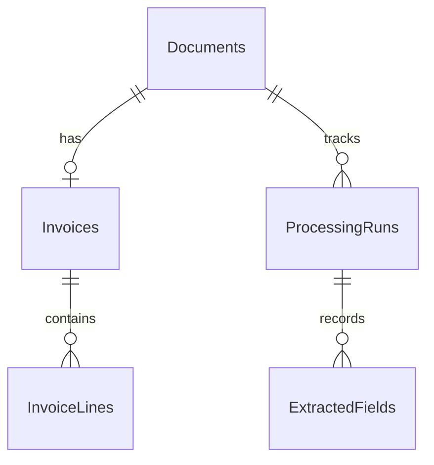

# Architecture

[Project overview](../README.md) · [Setup](../Wida.Api/README.md) · [API reference](api.md)

## Projects and dependencies

The solution contains three .NET 10 projects:

| Project | Responsibility | Main entry points |
| --- | --- | --- |
| `Wida.Api` | HTTP routing, upload file storage, JSON serialization, configuration, and OpenAPI/Scalar. | [Program.cs](../Wida.Api/Program.cs), [controllers](../Wida.Api/Controllers) |
| `Wida.Bll` | Document, invoice, and processing workflows; DTO mapping; invoice validation; analysis contracts. | [services](../Wida.Bll/Services), [DTOs](../Wida.Bll/Dtos), [InvoiceValidator](../Wida.Bll/Validators/InvoiceValidator.cs) |
| `Wida.Dal` | EF Core entities, PostgreSQL mappings and migrations, repositories, and the Azure analyzer. | [WidaDbContext](../Wida.Dal/Persistence/WidaDbContext.cs), [repositories](../Wida.Dal/Repositories), [AzureDocumentAnalyzer](../Wida.Dal/Services/AzureDocumentAnalyzer.cs) |

Declared project references are `Wida.Api → Wida.Bll`, `Wida.Api → Wida.Dal`, and `Wida.Bll → Wida.Dal`. Startup calls `AddDal(configuration)` and `AddBll()` to register the database context, repositories, analyzer, and services with scoped lifetimes.

The current analyzer implementation and DAL registration import `IDocumentAnalyzer` and analysis models from BLL. DAL has no reference to that project, so these types cannot resolve. Adding a reverse project reference would create a cycle; the contracts need a shared location or the implementation/registration needs to move. This is an existing integration issue, not an additional dependency to install.

## Request flows

### Document upload

`DocumentsController` writes the multipart `file` to `<content-root>/uploads/<generated-guid><original-extension>`. `DocumentService` creates metadata with document type `Unknown` and status `Uploaded`; `DocumentRepository` saves it to PostgreSQL. The response excludes the physical path and file bytes.

The current controller appends the generated filename twice when computing the database `StoragePath`, although the file itself is written to the correct location. Subsequent analysis uses the persisted path and fails for these uploads. Filesystem writes and metadata persistence do not share a transaction, so a failed metadata save can leave a file without a database record.

### Invoice creation

`InvoiceService` validates the request, checks that the document exists and has no invoice, then maps the request and optional lines before saving. Retrieval includes invoice lines without an explicit sort order. The database also enforces one invoice per document with a unique index on `Invoices.DocumentId`.

Invoice creation is independent of processing runs and does not change the document's type or status. Validation and creation failures currently propagate as exceptions; see [error behavior](api.md#error-behavior).

### Processing

The manual endpoint only inserts a `Pending` run with processor `Manual` and version `v1`. It does not queue work or transition that run later.

The invoice-analysis endpoint creates a separate `Running` run, saves it, reads the stored file, and waits for Azure's `prebuilt-invoice` analysis. The first analyzed document supplies selected invoice header fields. The service stores raw analysis and extracted fields, marks low-confidence or unscored fields for review, and completes the run. Caught analysis failures set the run to `Failed` with `DOCUMENT_ANALYSIS_FAILED`; the controller still returns `201` if saving that result succeeds.

Initial and final database saves are outside the analysis exception handler. A failed final save or interrupted request can leave a stored run as `Running`. There is no background worker or reconciliation job. A new analysis request creates a new run.

The processing service requires `IDocumentAnalyzer` in its constructor. Consequently, every processing route requires Azure configuration, including list/read requests and manual run creation.

## Data model

All entity primary keys are application-generated GUIDs. Document, invoice, and processing timestamps are initialized in UTC; invoice and due dates use `DateOnly`. All relationships shown above use cascade deletion in the database, although the API has no deletion endpoints.

| Entity | Stored data |
| --- | --- |
| `Document` | Original filename, content type, storage path, document type/status, upload and audit timestamps. |
| `Invoice` | Supplier and invoice details, dates, currency, amounts, audit timestamps, and document ID. |
| `InvoiceLine` | Position, description, quantity, unit, pricing/tax values, and invoice ID. |
| `ProcessingRun` | Processor/version, status, timestamps, error details, raw result, and document ID. |
| `ExtractedField` | Name, raw/normalized values, confidence, source, review flag, optional page/bounding data, and processing run ID. |

EF configurations are discovered through `ApplyConfigurationsFromAssembly`. Amounts and quantities use precision `(18, 4)`, line tax rates `(8, 4)`, and extraction confidence `(5, 4)`. `RawResult`, `NormalizedValue`, and `BoundingBox` use PostgreSQL `jsonb`. The current normalized value is serialized from a string, so a `jsonb` value may contain a JSON string rather than a typed number or object. The analyzer currently leaves page numbers and bounding boxes unset.

Migrations are committed in [Wida.Dal/Migrations](../Wida.Dal/Migrations) and applied explicitly with the commands in the [setup guide](../Wida.Api/README.md#database-migrations). Startup does not migrate or seed the database.

## Runtime configuration and storage

`Program.cs` requires `ConnectionStrings:DefaultConnection` before building the app. User Secrets support local Development configuration; deployment settings can use environment variables. The analyzer uses an endpoint and API key through `AzureKeyCredential`.

Uploaded files must remain accessible at their recorded filesystem paths. Preserve the upload directory together with the database; moving the content root or running instances with separate filesystems requires accounting for these paths. Uploads have no download endpoint, and raw/extracted analysis data has no public retrieval endpoint.

OpenAPI and Scalar routes are mapped only in Development, and HTTPS redirection is enabled. Startup currently configures no authentication, authorization, CORS policy, global exception handler, background processing, or health-check endpoint.
